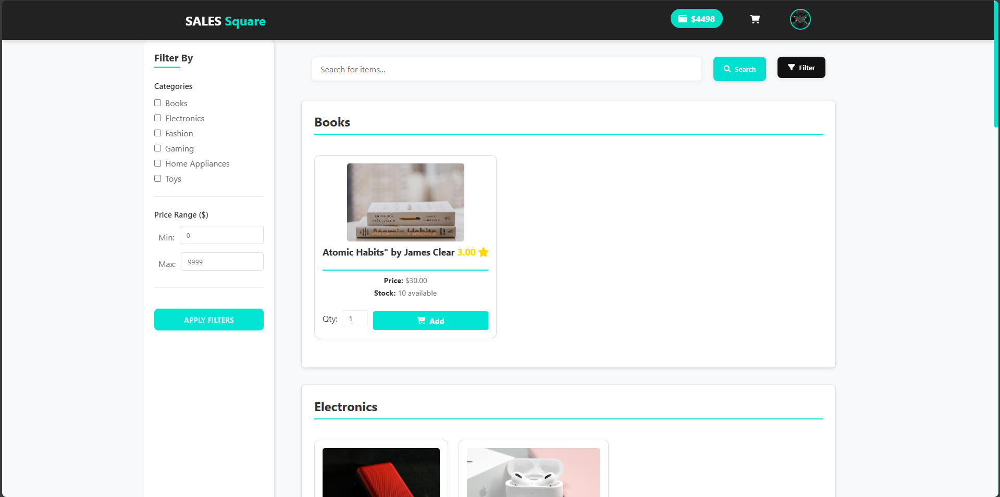
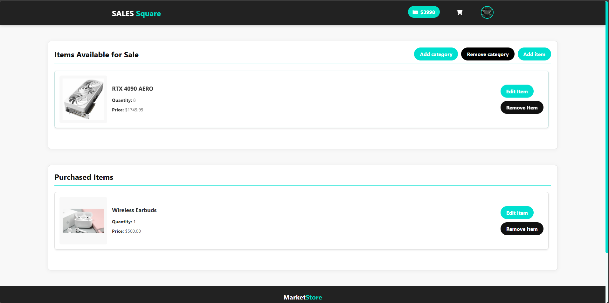

# Distributed Online Marketplace System

This project is a **distributed online marketplace platform** built using **Django** and **PostgreSQL**, designed to provide essential e-commerce functionalities through a scalable and modular architecture. It supports user account management, item listing, purchases, and secure financial transactions. The system also includes RESTful APIs and a distributed database model.

## Technology Stack

* **Backend:** Django (Python)
* **Database:** PostgreSQL (partitioned)
* **API Framework:** Django REST Framework (DRF)
* **Authentication:** Django built-in auth system
* **Architecture:** RESTful, modular, distributed schema design

How to Use the System
- Visit → [SALES Square](https://marketplace-production-ba97.up.railway.app)
- Register/Login → Create a new account and access marketplace features
- Edit Profile → Update name, email, and other personal details
- Deposit Funds → Add money to your account wallet to enable purchases
- Manage Inventory → Sellers can add, edit, and delete their own products
- Buy Products → Browse listings, add items to cart, and checkout securely
- Leave Reviews → Rate purchased products and sellers
- Generate Reports → View transaction and deposit history
- Explore Profiles → View your own profile or other users' product listings and ratings
- Provides a REST API interface that allows third-party stores to seamlessly integrate and list products from our platform onto theirs

## Implemented REST APIs

Three main functionalities are implemented using RESTful web services:

* User registration and login
* Product Listing via External API
* Deposit

These APIs follow standard REST conventions and can be tested through tools like Postman or cURL.

## API Documentation

The API documentation is available at [SALES\_Square/API](https://marketplace-production-ba97.up.railway.app/static/docs/salesquare_api_documentation.docx)

## Integration with External Stores

Third-party stores can integrate with our marketplace by:

1. Registering as an external partner by contacting us
2. Using our Product Listing API to sync inventory

## Screenshots

Below are sample screenshots of the system in use:




## Getting Started

### Initial Deployment

1. Connect your GitHub repository to Railway
2. Configure all required environment variables
3. Set up persistent volumes
4. Trigger initial deployment

### Post-Deployment Setup

After successful deployment:

```bash
# Apply database migrations
railway run python manage.py migrate

# Create superuser (for admin access)
railway run python manage.py createsuperuser

# Load initial data (optional)
railway run python manage.py loaddata initial_data.json
```
### Local Development

To mirror the Railway environment locally:

```bash
# Clone the repository
git clone <[repo-url](https://github.com/MoustafaHashem/Marketplace.git)>
cd SALES_square

# Set up a virtual environment
python -m venv venv
source venv/bin/activate  # On Windows: venv/Scripts/activate

# Create a superuser (optional)
python manage.py createsuperuser

# Run the development server
python manage.py runserver
```

## Distributed Database Design

The system uses **PostgreSQL** with a distributed partitioning model to improve scalability and performance:

* Logical partitioning of tables (e.g., by user or category)
* Optimized for high-volume reads/writes
* Schema supports horizontal scalability and data isolation

## Support and Troubleshooting

### Common issues and solutions:

1. Database Connection Issues

   * Verify DATABASE\_URL format
   * Check connection limits in PostgreSQL settings

2. Media Upload Problems

   * Confirm persistent volume is mounted
   * Verify file permissions

3. Performance Optimization

   * Enable Redis caching
   * Review query optimization
   * Consider adding more replicas

## Contributing

Contributions are welcome! Please fork the repository and submit a pull request with your changes.

## License

This project is licensed under the MIT License - see the [LICENSE](LICENSE) file for details.

## Contact

For questions or support, please [contact us](https://marketplace-production-ba97.up.railway.app/contactus) or open an issue in the repository.
